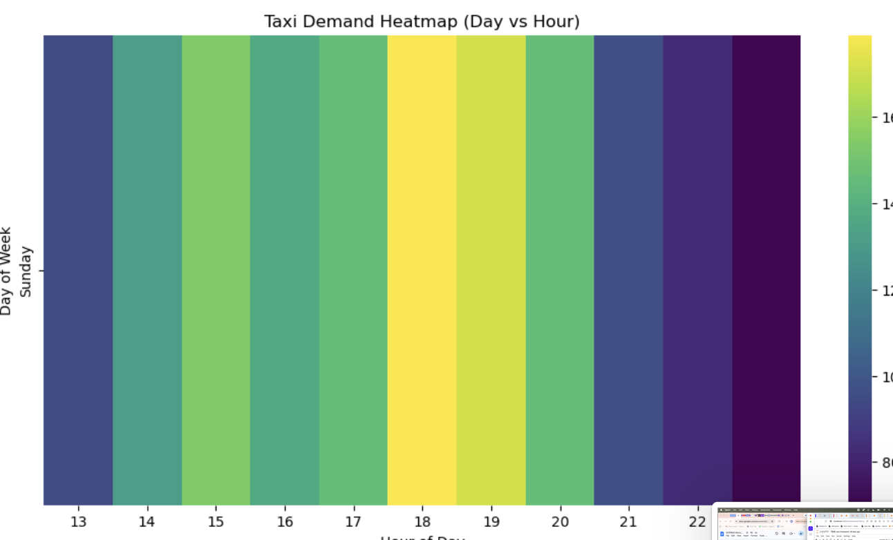
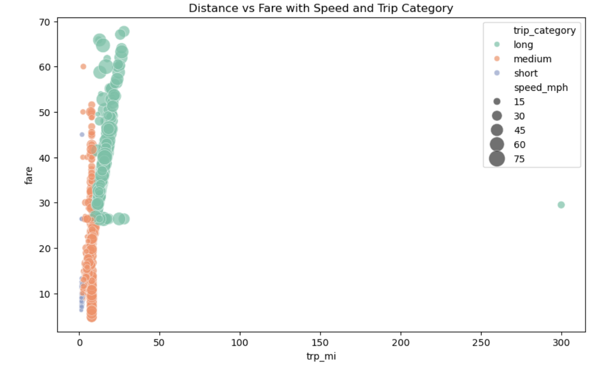
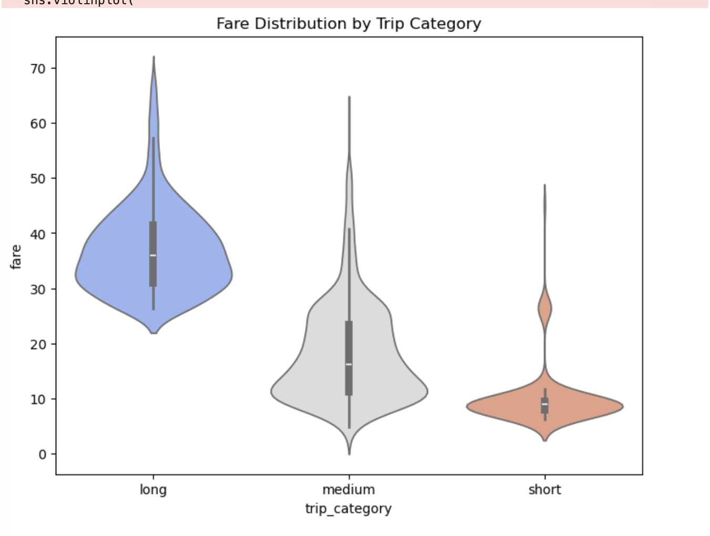
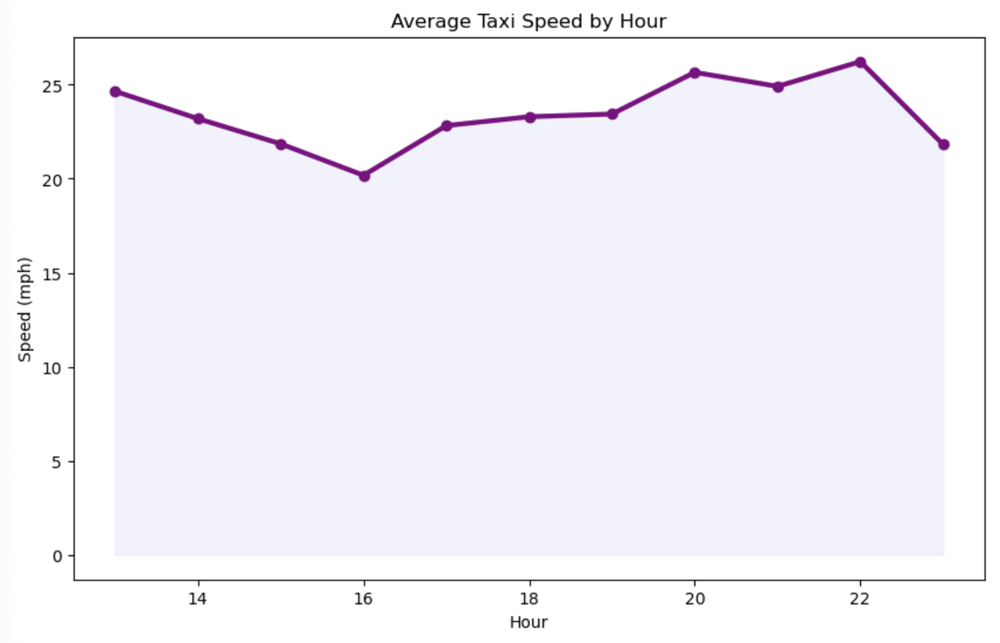
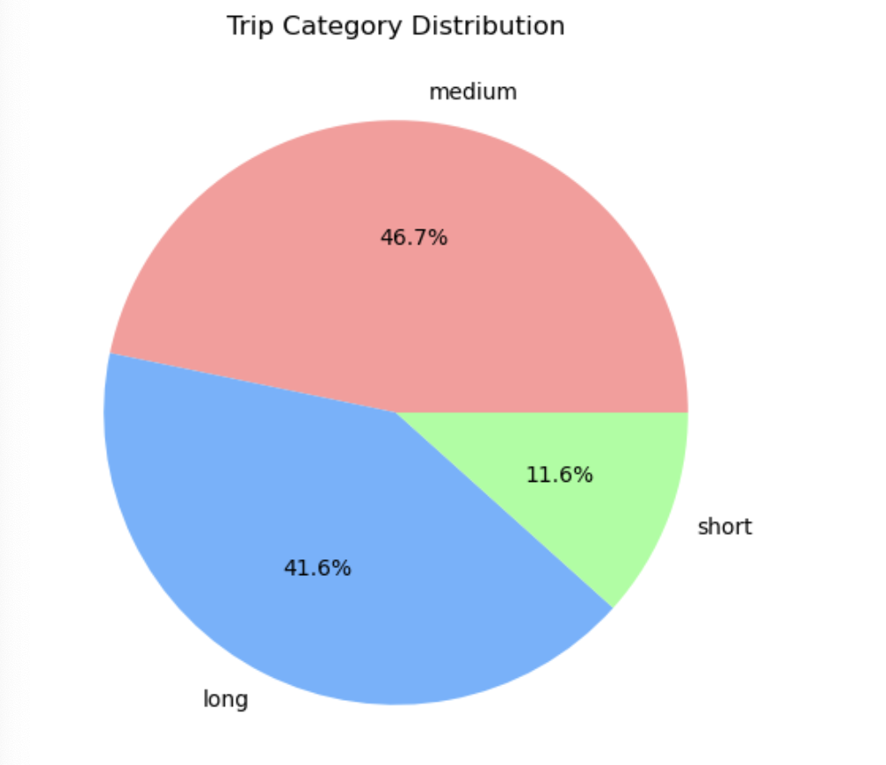
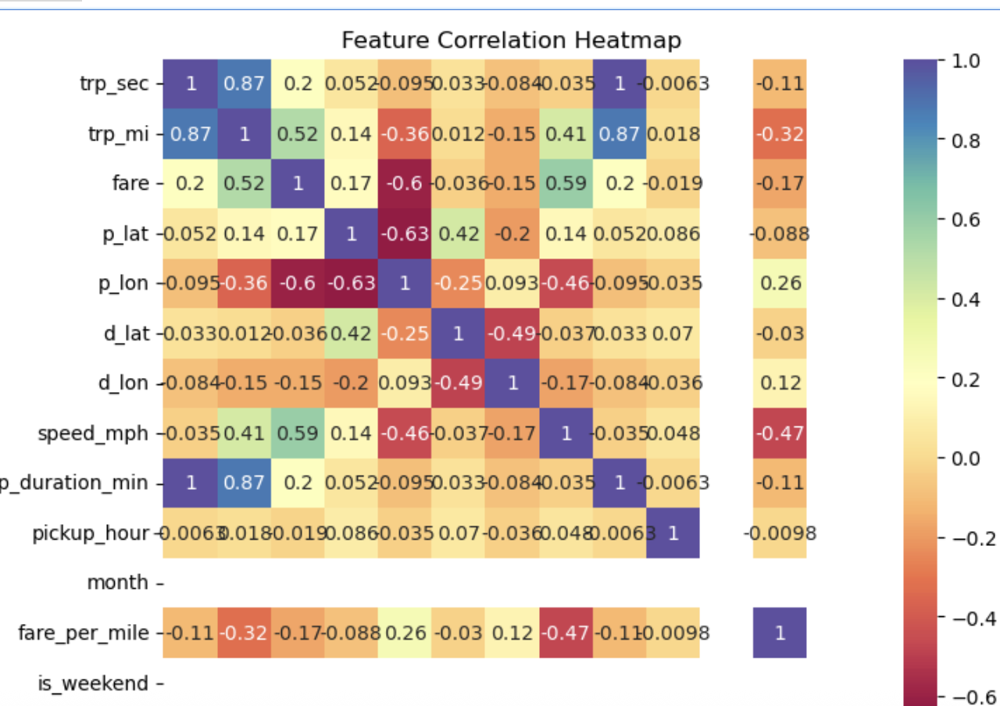
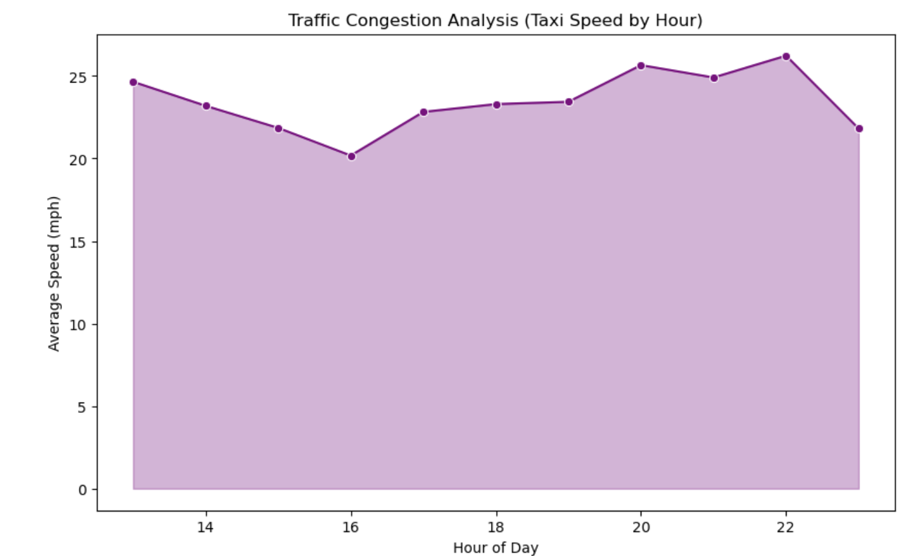
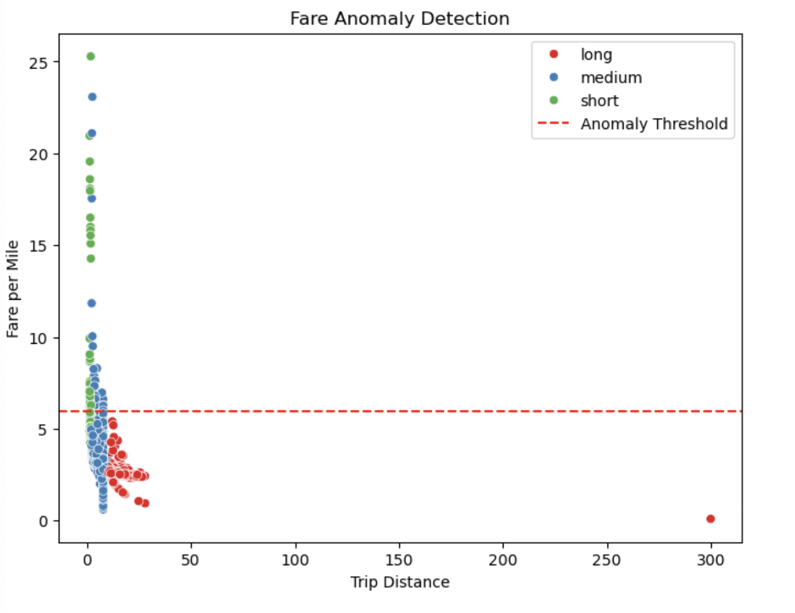
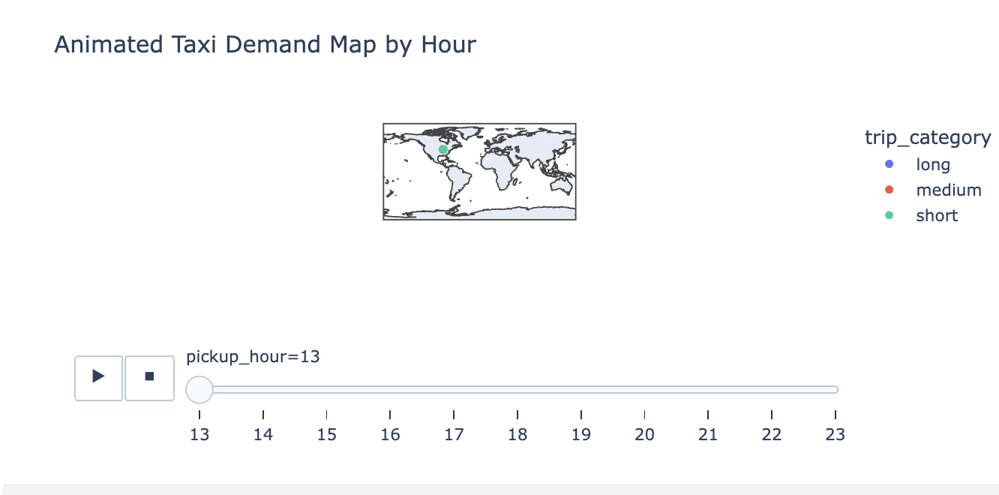

## Project README: Urban Mobility & Revenue Dynamics
## 1. The Pulse of the City: A Storytelling Introduction
Imagine a city that breathes in a rhythmic cycle of movement. Every minute, hundreds of vehicles traverse the asphalt arteries of the urban landscape. For the city planner, these are numbers; for the driver, a livelihood; but for the data scientist, they are a story.

This project began with a simple question: How does a city move? By diving into thousands of raw trip records, we sought to uncover the hidden patterns behind the chaos—why demand spikes at 6 PM, where the most lucrative "honey pots" are located, and how traffic congestion physically slows the pulse of the city during the afternoon rush. This isn't just an analysis of distances; it is a digital reconstruction of urban life through the lens of mobility.

## 2. The Data Architecture (SQL)
Before analysis could begin, the raw data required a rigorous "cleaning odyssey" to transform it from a chaotic collection of entries into a high-performance analytical dataset.
The foundation of this project lies in a robust SQL-based ETL (Extract, Transform, Load) process. Before any visualization could occur, the dataset underwent a multi-stage refinement to ensure data integrity and high-performance querying.
The raw dataset contained inconsistent naming conventions and formatting issues. Columns were renamed for better readability, and empty values were normalized.

## Standardizing column names
ALTER TABLE taxi1 RENAME COLUMN trip_start_timestamp TO start_ts;
ALTER TABLE taxi1 RENAME COLUMN trip_end_timestamp TO end_ts;
ALTER TABLE taxi1 RENAME COLUMN trip_seconds TO trp_sec;
ALTER TABLE taxi1 RENAME COLUMN trip_miles TO trp_mi;

## -- Converting empty strings to NULL
UPDATE taxi1
SET 
    trp_sec = NULLIF(trp_sec, ''),
    trp_mi  = NULLIF(trp_mi, ''),
    fare    = NULLIF(fare, '');
## 2. Advanced Data Imputation

Instead of removing missing values, mean imputation was applied to maintain dataset distribution and avoid bias.

-- Filling missing values with dataset averages
UPDATE taxi1 t
JOIN (
    SELECT 
        AVG(trp_sec) AS avg_sec, 
        AVG(trp_mi) AS avg_mi 
    FROM taxi1
) a
SET 
    t.trp_sec = IFNULL(t.trp_sec, a.avg_sec),
    t.trp_mi  = IFNULL(t.trp_mi, a.avg_mi);
⏱️ 3. Temporal Feature Engineering

## Extracted time-based features to support trend analysis and behavioral insights.

SELECT 
    trip_id,
    start_ts,
    HOUR(start_ts) AS pickup_hour,
    DAYNAME(start_ts) AS day_of_week,
    CASE 
        WHEN DAYOFWEEK(start_ts) IN (1, 7) THEN 'Weekend'
        ELSE 'Weekday' 
    END AS day_type
FROM taxi1;
## 📊 4. Advanced Analytics (Window Functions)
🔹 Percentile Ranking (Outlier Detection)

Identified the top 5% longest trips using window functions.

SELECT * FROM (
    SELECT 
        trip_id, 
        trp_sec,
        PERCENT_RANK() OVER (ORDER BY trp_sec) AS duration_percentile
    FROM taxi1
) t 
WHERE duration_percentile >= 0.95;
## 🔹 Moving Average (Trend Smoothing)

Calculated a 10-trip rolling average to analyze fare trends over time.

SELECT 
    trip_id, 
    fare,
    AVG(fare) OVER(
        ORDER BY start_ts 
        ROWS BETWEEN 9 PRECEDING AND CURRENT ROW
    ) AS moving_avg_fare
FROM taxi1;
## ✅ 5. Data Integrity Audit

Ensured dataset accuracy by removing invalid or impossible records.

-- Removing invalid entries
DELETE FROM taxi1 
WHERE trp_sec <= 0 
   OR trp_mi <= 0 
   OR fare < 0;
🚀 Key Outcomes
Improved data quality and consistency through cleaning and standardization
Enabled time-based analysis using feature engineering
Applied advanced SQL techniques (window functions, imputation)
Built a foundation for data-driven decision-making and analytics

## 3. Behavioral Deep Dive (Python)
With a clean foundation, Python was employed to perform high-level statistical analysis and uncover the "why" behind the data.

Statistical Insights
The Efficiency Inverse: Analysis revealed that short-haul trips are actually more lucrative on a per-mile basis ($6.46/mile) compared to long-distance trips ($2.59/mile).
Revenue Concentration: The "Top 10% Rule" was confirmed; the highest-fare trips generate approximately 19.4% of the total revenue.
The Congestion Valley: By grouping by pickup_hour, we identified a clear dip in average speeds during the 4 PM rush hour (~20.18 mph) compared to the late-night free-flow (~26.23 mph).

##  When is taxi demand highest?

“The heatmap shows that taxi demand peaks between 6–7 PM, with a sustained high-demand period from mid-afternoon to early evening. Demand drops significantly after 9 PM, indicating that most trips are concentrated around evening commute and leisure hours, especially on weekends.”
## How do distance, fare, and speed relate?

 “The scatter plot shows a clear positive relationship between trip distance and fare, although variability indicates the influence of factors like traffic and surge pricing. Short trips tend to have lower speeds but higher fare per mile, while long trips are faster but less efficient in revenue generation. Additionally, the presence of outliers highlights the importance of data cleaning before analysis or modeling.”
 ## How do fares vary across trip categories?

“The violin plot shows that long trips generate the highest fares with significant variability, while short trips have the lowest but most consistent fares. Medium trips fall in between, with a wider spread indicating variability due to traffic or pricing factors. This highlights that while long trips drive total revenue, short trips offer more predictable pricing patterns.”
## #When is traffic slowest?

“The analysis shows that taxi speeds are lowest around 4 PM, indicating peak traffic congestion during late afternoon. Speeds improve after 5 PM and reach their highest levels between 8 PM and 10 PM when roads are less crowded. This highlights how traffic conditions vary significantly throughout the day, impacting trip efficiency and pricing strategies.”

## What types of trips dominate?

“The trip distribution shows that medium-distance trips dominate the dataset, followed closely by long trips, while short trips represent a smaller portion. This indicates that most taxi demand is driven by mid-to-long distance travel. However, short trips, although fewer, offer higher fare efficiency per mile, highlighting an opportunity for optimizing pricing and service strategies.”

## Where are taxi hotspots?

“The pickup density map shows that taxi demand is highly concentrated around a central urban area, likely representing the city’s business or transit hub. While pickups are scattered across other regions, the majority occur in this core zone. High fares are distributed across locations, indicating that trip distance, rather than location alone, drives fare values. This highlights the importance of strategic driver positioning in high-demand areas.”
## What factors affect taxi fare?

“The correlation analysis shows that trip distance is the strongest factor affecting taxi fare, followed by speed, which indirectly reflects trip type and road conditions. Trip duration and time of day have relatively weak influence, indicating that the pricing model is primarily distance-based. Additionally, slower trips tend to have higher fare per mile due to traffic conditions.”
## When does traffic slow taxis the most?

“The analysis shows that taxi speeds are lowest around 4 PM, indicating peak traffic congestion during the late afternoon. Speeds improve after 5 PM and reach their highest levels between 8 PM and 10 PM when roads are less crowded. This demonstrates how traffic conditions significantly impact trip efficiency throughout the day.”

## Are some trips overpriced compared to distance?

“The anomaly detection analysis shows that most trips fall within a normal fare-per-mile range, but short trips tend to have significantly higher costs due to base fare effects. A few extreme outliers were identified, indicating potential data inconsistencies. Additionally, there is a clear inverse relationship between distance and fare per mile, highlighting non-linear pricing in taxi services.”
## How does taxi demand move across the city during the day?

  “The animated demand map shows that taxi demand starts dispersed across the city in the afternoon, gradually concentrates toward central urban areas during evening peak hours, and then declines at night. This indicates a hub-based demand pattern driven by commuting behavior, where most trips converge toward key city centers during peak times.”
  

## 4. Challenged Insights: Breaking the Norms

The 6 PM Paradox: While demand peaks sharply at 6 PM due to commutes, it collapses rapidly after 8 PM. This suggests that the city’s taxi ecosystem is a "commuter hub" rather than a late-night service.

Speed vs. Distance: Interestingly, the average speed for "Long" trips (33.8 mph) is more than five times faster than "Short" trips (6.3 mph), likely because long-distance trips utilize highway corridors while short trips are trapped in urban street congestion.

## 5. Conclusion
This project demonstrates that urban mobility is far from random. By combining the structural power of SQL with the analytical flexibility of Python, we transformed 7,400 raw records into a vivid narrative of city life. We discovered that the most valuable trips for a driver’s efficiency are short bursts, while the most critical trips for the ecosystem’s total revenue are the long-distance outliers. These insights provide a roadmap for fleet optimization and urban infrastructure planning, proving that in the world of data, every trip has a destination beyond the map.
